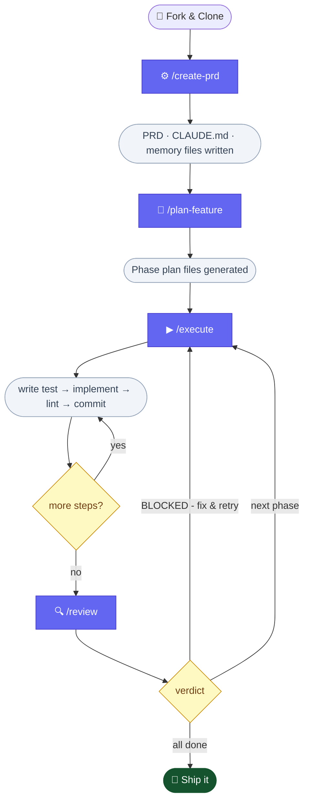

# AI Dev Harness

A GitHub template that gives Claude Code a structured development workflow — from idea to shipped code — using slash commands, persistent memory, and enforced TDD.

Fork it, run `/create-prd`, and Claude handles the rest: requirements gathering, implementation planning, test-driven development, and phase-by-phase review.

---

## How It Works



Each command is a markdown instruction file in `.claude/commands/`. Claude Code reads them as slash commands and follows them precisely.

---

## Getting Started

**1. Fork and clone**

Click **Use this template** on GitHub, clone your fork, then open it in Claude Code:

```bash
git clone https://github.com/your-username/your-repo
cd your-repo
claude
```

**2. Define your project**

```
/create-prd
```

Claude interviews you about your app (problem, users, features, tech stack, commit style), then writes:
- `.claude/PRD.md` — product requirements with acceptance criteria
- `CLAUDE.md` — project config (test command, lint command, naming convention)
- `.claude/memory/preferences/` — your coding, testing, and commit style preferences

**3. Generate implementation plans**

```
/plan-feature
```

With no arguments, Claude reads all phases from the PRD and generates a step-by-step plan file for each one. Or target a single phase:

```
/plan-feature phase-2-auth
```

**4. Build with TDD**

```
/execute .agents/plans/phase-1-setup.md
```

Claude works through every step in the plan: writes the failing test, implements the code, runs the full suite, fixes failures (max 3 attempts), runs lint, commits — and checks off each step in the plan file as it goes.

**5. Review before advancing**

```
/review
```

Runs tests + lint, checks every PRD acceptance criterion (✅ covered / ⚠️ partial / ❌ missing), scans for code issues, and gives a hard APPROVED or BLOCKED verdict. BLOCKED means something specific needs fixing before you move on.

---

## Project Structure

```
your-repo/
├── CLAUDE.md                        # Project config (written by /create-prd)
├── .claude/
│   ├── PRD.md                       # Product requirements
│   ├── commands/                    # Slash command definitions
│   │   ├── create-prd.md
│   │   ├── plan-feature.md
│   │   ├── execute.md
│   │   ├── review.md
│   │   ├── test.md
│   │   ├── commit.md
│   │   ├── prime.md
│   │   ├── help.md
│   │   └── init-project.md          # Manual config escape hatch
│   └── memory/                      # Persistent memory across sessions
│       ├── MEMORY.md                # Memory index (loaded by /prime)
│       ├── user_profile.md
│       ├── project_decisions.md
│       ├── feedback_corrections.md
│       └── preferences/
│           ├── testing_style.md
│           ├── coding_style.md
│           └── commit_style.md
└── .agents/
    └── plans/                       # Generated phase plan files
```

---

## Command Reference

| Command | What it does |
|---|---|
| `/create-prd` | Interview → writes PRD, CLAUDE.md, and memory preference files |
| `/plan-feature [name]` | No args: plans all PRD phases. With name: plans one specific phase |
| `/execute <plan-file>` | TDD cycle per step: test → implement → lint → commit |
| `/review [plan-file]` | Tests, lint, PRD alignment, code scan → APPROVED or BLOCKED |
| `/test [path]` | Run tests, triage failures, attempt fixes |
| `/commit [message]` | Semantic commit following the project's configured style |
| `/prime` | Load project context into a fresh Claude session |
| `/help` | Full command reference with usage notes |

---

## Memory System

Memory files in `.claude/memory/` persist your preferences and decisions across Claude sessions. They are not auto-loaded — `/prime` reads the index at session start and loads files on demand, keeping context lean.

| File | What it stores |
|---|---|
| `user_profile.md` | Your role, tech background, collaboration style |
| `project_decisions.md` | Key technical decisions and their rationale |
| `feedback_corrections.md` | What worked and what didn't — corrections over time |
| `preferences/testing_style.md` | Test framework, TDD conventions, fixture patterns |
| `preferences/coding_style.md` | Naming, file structure, error handling rules |
| `preferences/commit_style.md` | Conventional or simple commit format |

---

## The `/execute` TDD Pipeline

Every step in a phase plan goes through the same cycle:

```
1. Write the failing test (confirmed to fail before implementation)
2. Implement the minimum code to pass
3. Run the full test suite — fix failures (max 3 attempts)
4. Run lint — fix auto-fixable errors
5. Commit with a semantic message
6. Mark step complete (- [ ] → - [x]) in the plan file
```

Claude halts and asks for help if tests fail after 3 attempts, a test passes before implementation exists, or lint errors can't be auto-fixed.

---

## Requirements

- [Claude Code](https://claude.ai/code) CLI
- Git

No other dependencies — the harness is language-agnostic. `/create-prd` configures the test and lint commands for your specific stack.
